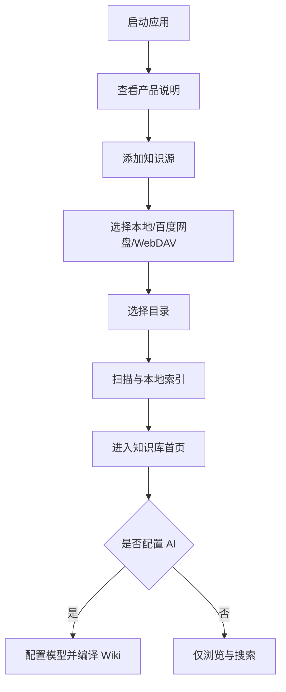
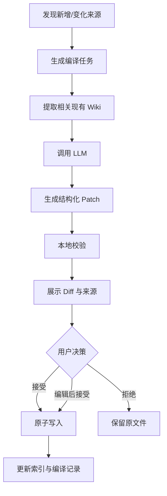

# MVision 跨端 AI 知识客户端开发需求

> 文档状态：Draft v0.1  
> 面向对象：Codex、产品设计、客户端开发、测试  
> 产品名称：MVision  
> 更新日期：2026-07-24

## 0. Codex 执行摘要

MVision 是一个“知识领域的 Infuse”：用户连接自己的本地目录或云存储，应用扫描其中的 Markdown、PDF、图片等资料，在本地建立索引，并由 LLM 将原始资料持续编译为互相链接、可追溯、可审核的个人 Wiki。

首期正式平台：

- iOS / iPadOS
- Android
- HarmonyOS NEXT
- macOS
- Windows

核心约束：

1. 用户拥有数据。Markdown 是知识正文的唯一事实来源，不使用专有正文格式。
2. 应用不提供自有云盘，用户选择自己的存储。
3. 原始资料与 AI 生成的 Wiki 必须隔离。
4. LLM 不得静默覆盖知识，所有变更必须先生成可审核的 Patch/Diff。
5. 移动端以阅读、发现、搜索和快速记录为主；桌面端以导入、编辑、整理和批量审核为主。
6. Flutter 是共享 UI 技术栈；HarmonyOS 使用 OpenHarmony Flutter 适配和必要的 ArkTS 桥接。
7. 首版优先实现完整、稳定的主链路，不追求 Obsidian 全功能兼容。

Codex 在实现前必须先阅读本文全文。若实现与本文冲突，应以本文中标记为 `P0` 的需求为准；仍无法判断时，记录 Open Question，不得擅自扩大范围。

---

## 1. 产品愿景

### 1.1 一句话定位

连接用户自己的存储，让 AI 自动把零散资料整理成漂亮、可阅读、可搜索、可持续演进的个人 Wiki。

### 1.2 产品类比

| 媒体客户端 | MVision |
| --- | --- |
| 视频文件 | Markdown、PDF、网页快照、图片 |
| NAS、网盘、媒体服务器 | 百度网盘、WebDAV、本地目录 |
| 媒体资料库 | 个人知识库 |
| 元数据刮削 | LLM Wiki 编译 |
| 海报、简介、演职员 | 主题封面、摘要、标签、关系 |
| 播放器 | 知识阅读器与 Markdown 编辑器 |
| 播放进度 | 阅读、编辑和知识演进状态 |

### 1.3 产品北极星

用户打开应用后，不需要先整理文件，也能在一分钟内重新发现一条对自己有价值的知识。

### 1.4 核心价值

- **自有存储**：数据保存在用户选择的位置，不被应用锁定。
- **漂亮阅读**：提供接近内容消费产品，而不是传统文件管理器的体验。
- **AI 编译**：LLM 将新增资料增量整理到持久化 Wiki，而不是每次提问都重新检索和生成。
- **来源可追溯**：AI 结论必须能定位到原始来源。
- **多端连续**：移动端适合阅读和轻操作，桌面端适合生产和管理。

---

## 2. 用户与场景

### 2.1 目标用户

首期目标用户是有长期知识积累需求、能够理解“文件归自己所有”的个人用户：

- 软件工程师与技术负责人
- 研究人员、产品经理、设计师
- 长期使用 Markdown、网盘或 NAS 的知识工作者
- 希望用 AI 整理资料，但不愿把全部资料迁入封闭 SaaS 的用户

### 2.2 典型场景

#### 场景 A：连接已有资料

用户连接百度网盘中的 `MVision` 目录。应用扫描已有 Markdown、PDF 和图片，生成本地资料库，不改变原始目录。

#### 场景 B：LLM Wiki 编译

用户将新的项目文档放进 `sources/`。应用识别新增内容，LLM 提议更新三个现有 Wiki 页面、新建一个页面并建立五条链接。用户查看 Diff 后确认写入。

#### 场景 C：手机阅读

用户在手机首页看到最近更新、继续阅读和 AI 新发现，直接进入主题阅读，而不是先操作文件树。

#### 场景 D：桌面深度整理

用户在 Windows 或 macOS 上使用三栏布局，对照原始来源与 Wiki 正文，批量接受、拒绝或编辑 AI Patch。

#### 场景 E：离线使用

用户在无网络环境下阅读已缓存资料、全文搜索、记录 Inbox。恢复网络后应用再执行同步。

---

## 3. 产品范围

### 3.1 P0：首个可发布版本

- 跨端统一账号无要求；应用可在无产品账号的情况下使用。
- 支持本地目录、百度网盘、WebDAV 三种知识源。
- 支持 Markdown、常见图片和 PDF。
- 本地缓存与离线阅读。
- Markdown 阅读器。
- 基础 Markdown 源码编辑与预览。
- 主题资料库首页。
- 文件与主题搜索。
- `[[Wiki Link]]`、普通 Markdown 链接和反向链接索引。
- 用户自带模型密钥（BYOK）。
- OpenAI-compatible Chat Completion 接口。
- LLM Wiki 增量编译。
- Patch/Diff 审核后写入。
- 来源引用与跳转。
- 同步冲突副本，不静默覆盖。
- 深色模式与浅色模式。
- iOS、Android、HarmonyOS NEXT、macOS、Windows 可安装构建。

### 3.2 P1：首版稳定后

- 更多模型提供商的原生配置。
- 阿里云盘、S3、Git、SMB/NAS 连接器。
- CodeMirror 6 高级 Markdown 编辑器。
- 语义搜索、Embedding 与混合检索。
- PDF 文本抽取、OCR。
- 分享扩展和 Web Clipper。
- Wiki 健康检查。
- 本地加密。
- macOS Spotlight、Windows 文件关联。
- 多窗口。

### 3.3 非目标

以下内容不属于 P0：

- 多人实时协作
- 自有云存储
- 在线 Office 文档
- 任务管理平台
- Canvas 或无限画布
- 插件市场
- 实时 CRDT 协同编辑
- 完整 Obsidian 插件兼容
- 社交发布平台
- 企业权限系统
- 在应用服务器保存用户正文

---

## 4. 信息架构

### 4.1 一级导航

移动端使用四个一级入口：

1. 首页
2. 知识库
3. AI
4. 搜索

设置、数据源和同步状态放在头像/设置入口，不长期占据主导航。

桌面端使用侧栏：

- 首页
- 最近
- 收藏
- 待整理
- 数据源
- 知识主题
- 同步与冲突
- 设置

### 4.2 内容层级

```text
知识库
├── 主题
│   ├── Wiki 页面
│   │   ├── 正文
│   │   ├── 关联知识
│   │   └── 来源引用
│   └── 原始资料
├── 待整理资料
└── AI 编译记录
```

### 4.3 文件层与知识层

- **文件层**反映真实存储结构，只在数据源管理、来源查看和高级操作中出现。
- **知识层**由主题、页面、关系和最近活动组成，是日常使用的默认界面。
- 文件夹不直接等同于主题；主题可以跨文件夹和跨数据源。

---

## 5. 核心用户流程

### 5.1 首次使用



验收要求：

- 不配置 AI 也能完整使用浏览、编辑和同步功能。
- 首次扫描必须显示进度、已处理数量和可取消操作。
- 扫描失败不得破坏原始文件。

### 5.2 LLM Wiki 编译



### 5.3 同步

```text
启动/回到前台/手动同步
        ↓
读取远端清单
        ↓
比较内容哈希与同步状态
        ↓
仅远端变化：下载
仅本地变化：上传
双方变化：生成冲突副本
        ↓
更新本地索引
```

---

## 6. 功能需求

### 6.1 数据源连接器

#### FR-SOURCE-001 统一连接器接口（P0）

所有数据源实现统一接口，UI 和 Wiki 引擎不得直接依赖具体厂商 SDK。

```dart
abstract interface class StorageConnector {
  String get sourceId;
  Future<ConnectionResult> connect();
  Future<List<StorageEntry>> list(String path);
  Future<Uint8List> read(String path);
  Future<WriteResult> write(String path, Uint8List data);
  Future<void> move(String from, String to);
  Future<void> delete(String path);
  Future<StorageMetadata> metadata(String path);
}
```

#### FR-SOURCE-002 本地目录（P0）

- 用户可以选择或创建知识库目录。
- 不接管目录所有权。
- 扫描时默认忽略隐藏文件、临时文件和应用配置目录。
- 删除应用不得删除用户原始目录。

#### FR-SOURCE-003 百度网盘（P0）

- OAuth 登录。
- 用户主动选择远端目录。
- 支持列出、下载、上传、移动、删除和读取元数据。
- Token 存储在平台安全存储中。
- API 限流、授权失效和网络错误必须有可恢复状态。
- 不允许在日志中输出 Token、Authorization Header 或正文。

#### FR-SOURCE-004 WebDAV（P0）

- 支持 HTTPS WebDAV。
- 支持用户名/密码或 Token。
- 提供“测试连接”。
- 允许配置服务器地址和根目录。
- 明文 HTTP 必须给出明确安全警告，默认禁止。

### 6.2 扫描、缓存和索引

#### FR-INDEX-001 增量扫描（P0）

- 使用路径、修改时间、大小和内容哈希判断变化。
- 首次扫描建立完整索引。
- 后续只处理新增、变化和删除项。
- 扫描任务可暂停、取消和继续。

#### FR-INDEX-002 本地数据库（P0）

SQLite 只存派生数据，不存唯一正文。删除数据库后必须能从原始文件重建。

核心表建议：

```text
documents
document_contents_fts
links
topics
topic_documents
sources
sync_states
sync_conflicts
wiki_jobs
wiki_patches
reading_states
```

#### FR-INDEX-003 全文搜索（P0）

- 支持标题、正文、标签和路径。
- 搜索结果显示命中摘要。
- 结果可按最近修改、相关度和数据源筛选。
- P0 使用 SQLite FTS5；语义搜索属于 P1。

### 6.3 Markdown

#### FR-MD-001 原始格式（P0）

- 正文保存为 UTF-8 Markdown。
- 保留 YAML Frontmatter。
- 支持 `.md` 和 `.markdown`。
- 不因打开和保存而无意义地重排用户 Markdown。

#### FR-MD-002 阅读器（P0）

至少支持：

- 标题与目录
- 段落、列表、任务列表
- 加粗、斜体、删除线
- 引用
- 表格
- 代码块与语法高亮
- 图片
- 普通链接
- `[[Wiki Link]]`
- 基础数学公式
- Mermaid 的安全渲染或静态降级

#### FR-MD-003 编辑器（P0）

- Markdown 源码编辑。
- 编辑/预览切换。
- 自动保存。
- 撤销/重做。
- 搜索。
- 工具栏插入常用语法。
- 中文输入法、软键盘和桌面快捷键可用。
- P0 不要求所见即所得。

### 6.4 资料库与阅读体验

#### FR-LIBRARY-001 首页（P0）

首页至少包含：

- 继续阅读
- 最近更新
- 知识主题
- 待整理资料数量
- 最近 AI 编译结果
- 收藏

首页不得以文件树作为主体。

#### FR-LIBRARY-002 主题页（P0）

显示：

- 主题名称与摘要
- 核心 Wiki 页面
- 最近更新
- 相关主题
- 原始资料数量
- 来源分布

#### FR-READER-001 阅读页（P0）

- 优先保证中文长文阅读。
- 支持目录跳转。
- 显示相关知识和来源。
- 支持收藏、复制链接、在原始文件中打开。
- AI 生成内容必须有可辨识但克制的标记。

### 6.5 LLM 与 Wiki

#### FR-AI-001 BYOK（P0）

- 支持 OpenAI-compatible Endpoint。
- 用户配置 Base URL、API Key、模型名。
- 提供连接测试。
- API Key 只能存入系统安全存储。
- 无 Key 时不阻塞非 AI 功能。

#### FR-AI-002 原始资料隔离（P0）

推荐知识库目录：

```text
KnowledgeVault/
├── inbox/
├── sources/
├── wiki/
├── attachments/
└── .mvision/
```

规则：

- `sources/` 视为原始资料，AI 不得修改。
- `wiki/` 由用户和 AI 共同维护。
- `inbox/` 用于快速记录，可由用户选择是否摄入。
- `.mvision/` 存储清单、编译状态和非正文配置。

#### FR-AI-003 Wiki 编译（P0）

LLM Wiki 编译器必须：

1. 识别本次新增或变化的来源。
2. 检索相关现有 Wiki 页面。
3. 优先更新已有主题，避免重复创建。
4. 生成摘要、交叉链接和来源引用。
5. 标记来源间的矛盾、不确定性和过期信息。
6. 输出结构化 Patch，不直接写文件。
7. 给出本次变更说明。

#### FR-AI-004 Patch 校验（P0）

Patch 在展示前必须通过本地校验：

- 目标路径位于允许写入的 `wiki/`。
- 不包含路径穿越。
- 不修改 `sources/`。
- Markdown 可解析。
- 引用的来源真实存在。
- 不删除未在 Patch 中明确声明的文件。
- 单次 Patch 超过配置阈值时要求二次确认。

#### FR-AI-005 Diff 审核（P0）

用户可以：

- 全部接受
- 按文件接受
- 逐项接受
- 编辑后接受
- 拒绝
- 查看每项变更引用的来源

接受写入必须使用临时文件加原子替换，并保留恢复信息。

#### FR-AI-006 知识问答（P0）

- 用户可对当前页面或全库提问。
- 回答必须附来源。
- P0 可以使用全文检索选取上下文，不要求向量数据库。
- 找不到可靠来源时必须明确说明，不得伪造引用。

### 6.6 同步

#### FR-SYNC-001 同步状态（P0）

每个文件记录：

```json
{
  "sourceId": "source-uuid",
  "path": "wiki/kelog.md",
  "localHash": "sha256:...",
  "remoteHash": "provider-or-sha256:...",
  "lastSyncedHash": "sha256:...",
  "lastSyncedAt": "2026-07-24T18:00:00+08:00"
}
```

#### FR-SYNC-002 冲突（P0）

当本地和远端相对上次同步均发生变化：

- 不覆盖任一版本。
- 保留当前本地文件。
- 将远端写为冲突副本。
- 在“同步与冲突”中提示用户。

冲突文件命名示例：

```text
kelog.conflict-iphone-20260724-180000.md
```

#### FR-SYNC-003 删除（P0）

- 删除先进入应用回收站或产生墓碑记录。
- P0 默认保留 30 天。
- 跨端删除必须能够恢复。
- 不得把一次远端列表异常解释成所有文件被删除。

#### FR-SYNC-004 后台同步（P0）

- 启动、回到前台、编辑保存后和用户手动触发时同步。
- Android/HarmonyOS/iOS 可利用系统允许的后台任务，但不得承诺实时后台同步。
- 桌面端可在应用运行时周期同步。

---

## 7. 跨端体验

### 7.1 移动端

移动端职责：

- 浏览
- 阅读
- 搜索与提问
- 快速记录
- 收藏
- 审核小规模变更

导航：

```text
首页 | 知识库 | AI | 搜索
```

约束：

- 核心操作支持单手完成。
- 不把复杂文件树放在首页。
- 触控目标不小于平台推荐尺寸。
- 正确处理安全区、软键盘和系统返回手势。

### 7.2 平板

- 默认双栏：资料列表 + 内容。
- 横屏可显示第三栏 AI/来源检查器。
- 支持键盘快捷键和拖放。

### 7.3 桌面

桌面职责：

- 批量导入
- 深度编辑
- 数据源管理
- 大规模 Diff 审核
- 同步冲突处理
- Wiki 结构整理

建议布局：

```text
数据源/导航 | 知识列表 | 阅读/编辑 | 可选 AI 检查器
```

窗口断点：

| 宽度 | 布局 |
| ---: | --- |
| `< 700px` | 单栏 |
| `700–1099px` | 双栏 |
| `1100–1499px` | 三栏 |
| `>= 1500px` | 三栏 + 检查器 |

桌面快捷键：

| 快捷键 | 功能 |
| --- | --- |
| `Cmd/Ctrl + K` | 命令面板 |
| `Cmd/Ctrl + P` | 快速打开 |
| `Cmd/Ctrl + N` | 新建笔记 |
| `Cmd/Ctrl + F` | 当前页搜索 |
| `Cmd/Ctrl + Shift + F` | 全库搜索 |
| `Cmd/Ctrl + Enter` | 提交 AI 指令 |
| `Cmd/Ctrl + \` | 切换侧栏 |
| `Cmd/Ctrl + ,` | 设置 |

### 7.4 平台适配

| 平台 | 共享技术 | 必要平台实现 |
| --- | --- | --- |
| iOS/iPadOS | Flutter | Swift、Keychain、BGTask、Share Extension |
| Android | Flutter | Kotlin、Keystore、WorkManager |
| HarmonyOS NEXT | OpenHarmony Flutter | ArkTS、安全存储、后台任务、文件与授权 |
| macOS | Flutter Desktop | Swift/AppKit、菜单、窗口、Keychain |
| Windows | Flutter Desktop | C++/Win32、窗口、凭证和安装更新 |

---

## 8. UI 与设计系统要求

### 8.1 设计目标

视觉品质参考 Infuse、VidHub 等内容客户端，但不得复制其品牌、布局细节或资产。产品应表现为沉静、精致的知识内容库，而不是密集的后台管理系统。

### 8.2 设计原则

- 内容优先，减少工具栏噪声。
- 使用层级、间距和材质区分区域，避免大量重边框。
- AI 状态清晰但不喧宾夺主。
- 深色模式不是简单反色。
- 动画用于表达空间和状态变化，不做无意义装饰。
- 手机、平板和桌面共享视觉语言，但不强求完全相同布局。

### 8.3 基础 Token

P0 至少建立以下设计 Token：

- Color
- Typography
- Spacing：`4 / 8 / 12 / 16 / 24 / 32 / 48`
- Radius
- Elevation/Surface
- Motion Duration
- Motion Curve
- Icon Size
- Content Width

业务页面不得直接散落不可追踪的颜色和间距常量。

### 8.4 重点动效

- 知识卡片进入阅读页。
- 数据源连接成功。
- 扫描进度。
- LLM Wiki 编译进度。
- Diff 接受/拒绝。
- 搜索结果切换。
- 桌面侧栏与检查器展开。

### 8.5 可访问性

- 支持系统字体缩放。
- 支持屏幕阅读器语义。
- 颜色不是状态的唯一表达。
- 键盘可完成桌面主要操作。
- 动画遵循系统“减少动态效果”设置。

---

## 9. 技术架构

### 9.1 推荐技术栈

| 层 | 技术 |
| --- | --- |
| UI | Flutter |
| 状态管理 | Riverpod |
| 路由 | go_router |
| 不可变模型 | Freezed / json_serializable |
| 本地数据库 | SQLite + Drift |
| 全文搜索 | SQLite FTS5 |
| 网络 | Dio |
| Markdown 解析 | Dart Markdown AST + 自定义渲染 |
| Markdown 编辑 | P0 原生源码编辑；P1 CodeMirror 6 |
| 密钥 | 平台 Secure Store 抽象 |
| AI | OpenAI-compatible API |
| HarmonyOS | OpenHarmony Flutter + ArkTS |
| 自动化 | 各平台 CI 构建与测试 |

### 9.2 暂不引入 Rust

P0 使用 Dart 完成扫描、哈希、同步、索引和 LLM 流程。出现下列明确需求后再评估 Rust：

- 数万文件索引不达标
- 高性能三方合并
- 本地向量索引
- 大文件增量传输
- 跨客户端复用加密/同步内核

### 9.3 工程目录建议

```text
mvision/
├── apps/
│   └── client/
│       ├── lib/mobile/
│       ├── lib/desktop/
│       ├── lib/shared/
│       ├── android/
│       ├── ios/
│       ├── macos/
│       ├── windows/
│       └── ohos/
├── packages/
│   ├── design_system/
│   ├── knowledge_core/
│   ├── markdown_engine/
│   ├── markdown_reader/
│   ├── markdown_editor/
│   ├── search_engine/
│   ├── sync_engine/
│   ├── wiki_engine/
│   ├── platform_api/
│   └── connectors/
│       ├── local_connector/
│       ├── baidu_connector/
│       └── webdav_connector/
├── docs/
│   ├── adr/
│   ├── architecture/
│   └── product/
├── tools/
└── tests/
```

### 9.4 依赖规则

- `knowledge_core` 不依赖 Flutter。
- `sync_engine` 不依赖具体连接器。
- `wiki_engine` 不依赖 UI。
- `design_system` 不依赖业务模块。
- 平台插件通过 `platform_api` 接口暴露。
- UI 不直接调用百度网盘、WebDAV 或 SQLite。
- 优先选择纯 Dart 依赖。
- 引入任何包含原生插件的依赖前，必须记录其 iOS、Android、HarmonyOS、macOS、Windows 支持状态。

---

## 10. 核心领域模型

```dart
class KnowledgeDocument {
  final String id;
  final String sourceId;
  final String path;
  final String title;
  final DocumentKind kind;
  final String contentHash;
  final DateTime modifiedAt;
  final bool isAvailableOffline;
}

class KnowledgeTopic {
  final String id;
  final String title;
  final String? summary;
  final List<String> documentIds;
  final DateTime updatedAt;
}

class SourceReference {
  final String sourceDocumentId;
  final String? anchor;
  final String excerpt;
}

class WikiPatch {
  final String id;
  final List<FilePatch> files;
  final List<SourceReference> references;
  final String summary;
  final PatchRiskLevel riskLevel;
}

class SyncConflict {
  final String sourceId;
  final String path;
  final String localHash;
  final String remoteHash;
  final DateTime detectedAt;
}
```

具体字段可在实现时细化，但必须保持：

- 文档身份与路径分离。
- 来源引用可以追溯。
- Patch 在写入前是独立实体。
- 同步状态不写入正文。

---

## 11. 安全与隐私

### 11.1 基本原则

- 无产品账号也可使用。
- 不上传用户正文到自有服务器。
- LLM 请求只发送完成当前任务所需的最小上下文。
- 明确展示当前使用的模型和发送的数据范围。
- 用户可以关闭全部 AI 能力。

### 11.2 凭证

- API Key、网盘 Token、WebDAV 凭证必须存入平台安全存储。
- 禁止写入普通配置、SQLite 明文字段和日志。
- 导出诊断包前必须清除凭证和正文。

### 11.3 文件写入

- 采用临时文件 + 原子替换。
- AI 不得直接写入来源目录。
- 所有路径必须规范化并验证位于允许根目录内。
- 删除默认可恢复。

### 11.4 日志

允许记录：

- 请求耗时
- HTTP 状态码
- 文件数量和大小
- 任务状态
- 匿名错误类型

禁止记录：

- API Key/Token
- Authorization Header
- 用户正文
- 完整文件内容
- 未脱敏的私人路径

---

## 12. 性能与质量目标

以下为 P0 工程目标，测试设备和数据集需要在项目启动后固化：

| 指标 | 目标 |
| --- | --- |
| 已有缓存时进入首页 | 体感立即可用，后台刷新 |
| 1,000 个 Markdown 初次索引 | 不阻塞 UI，可见进度 |
| 全文搜索输入响应 | 目标 `< 200ms` 返回首批结果 |
| 打开普通 Markdown | 目标 `< 300ms` 显示首屏 |
| 列表滚动 | 目标 60fps，避免持续掉帧 |
| 自动保存 | 用户停止输入后短延迟保存，不丢内容 |
| 崩溃恢复 | 未完成编辑可从临时状态恢复 |
| 同步失败 | 可重试，不破坏本地正文 |

性能任务不得牺牲数据安全。不能为了速度跳过冲突检测、原子写入或 Patch 校验。

---

## 13. 测试策略

### 13.1 单元测试

- 路径规范化与越界防护
- 内容哈希
- 增量扫描
- 同步状态机
- 冲突判断
- Wiki Link 解析
- Patch 校验
- Markdown Frontmatter 保留
- 来源引用校验

### 13.2 合约测试

为所有 `StorageConnector` 执行相同测试套件：

- 连接
- 列表
- 读取
- 写入
- 移动
- 删除
- 网络中断
- 授权失效
- 重复写入

### 13.3 集成测试

- 本地目录首次扫描到阅读。
- 百度网盘登录、选择目录、下载、编辑、上传。
- WebDAV 断线重试。
- 本地和远端同时修改产生冲突副本。
- LLM 生成 Patch、审核、写入和回滚。
- 删除数据库后重建索引。

### 13.4 UI 测试

- 手机单栏。
- 平板双栏。
- 桌面三栏及窗口缩放。
- 深色/浅色。
- 大字体。
- 中文输入法。
- 键盘导航。
- 无网络状态。
- 减少动态效果。

### 13.5 HarmonyOS 技术尖峰

正式业务开发前必须验证：

1. Flutter 页面、动画和长列表。
2. 中文输入法与长文编辑。
3. 文件读写。
4. SQLite/FTS5。
5. 百度 OAuth 回调。
6. 百度网盘上传下载。
7. WebView 与 JavaScript Bridge。
8. 安全存储。
9. 前后台任务。
10. PDF 与 Markdown 渲染。
11. 签名、安装和发布构建。

若任一 P0 能力不可用，应先形成 ADR 和替代方案，再继续依赖它的业务开发。

---

## 14. 开发阶段

### Phase 0：仓库与技术尖峰

- 建立 Monorepo 和依赖规则。
- 建立设计 Token。
- 跑通五个平台的最小构建。
- 完成 HarmonyOS 技术尖峰。
- 验证百度网盘 OAuth、上传和下载。
- 验证 SQLite/FTS5。

退出条件：

- 五个平台均有可安装 Hello Product。
- HarmonyOS 能完成百度网盘 Markdown 下载、编辑、上传闭环。

### Phase 1：本地知识阅读器

- 本地目录连接器。
- 扫描、缓存、索引。
- 首页、知识库、阅读页、搜索。
- Markdown 阅读。
- 基础编辑。
- 移动/桌面响应式外壳。

退出条件：

- 不使用 AI 和远端存储，也能作为完整本地 Markdown 知识客户端使用。

### Phase 2：自有存储

- 百度网盘连接器。
- WebDAV 连接器。
- 增量同步。
- 冲突副本。
- 回收站与恢复。
- 离线队列。

退出条件：

- 两台设备通过同一知识源完成稳定同步，不发生静默数据丢失。

### Phase 3：LLM Wiki

- BYOK。
- Wiki 编译任务。
- Patch 结构与校验。
- Diff 审核。
- 来源引用。
- 知识问答。

退出条件：

- 新资料可以在用户审核后增量更新现有 Wiki，且所有关键结论可追溯来源。

### Phase 4：产品品质

- 动画和转场。
- 空状态、错误状态和首次引导。
- 性能优化。
- 可访问性。
- 崩溃恢复。
- 安装、更新和商店发布。

---

## 15. P0 验收标准

### AC-001 添加知识源

用户能在支持的平台添加本地目录、百度网盘或 WebDAV，并看到可理解的连接状态。

### AC-002 浏览资料

连接含 Markdown 的目录后，应用能够扫描、索引并在首页和知识库中展示内容，不要求用户重新导入或转换格式。

### AC-003 跨端布局

同一核心数据在手机显示单栏、平板显示双栏、桌面显示三栏；窗口变化不导致状态丢失。

### AC-004 离线

断网后用户仍可打开已缓存页面、搜索本地索引和编辑本地 Markdown；恢复网络后同步队列继续执行。

### AC-005 冲突安全

两端同时修改同一文件时，应用生成明确的冲突副本并提示用户，不覆盖任一版本。

### AC-006 Wiki 编译

用户选择新增资料后，LLM 能提出新增、更新和关联建议，并以 Diff 展示；拒绝时不产生正文变化。

### AC-007 来源追溯

AI 生成页面中的引用可以跳转到真实来源或明确的来源片段；不存在的引用不得通过校验。

### AC-008 原始资料保护

任何 AI 操作都不能修改 `sources/`；自动化测试必须覆盖路径穿越和错误目标目录。

### AC-009 数据可迁移

用户不再使用应用时，仍可使用普通文件管理器和 Markdown 编辑器访问自己的正文。

### AC-010 平台交付

iOS、Android、HarmonyOS NEXT、macOS、Windows 均可完成安装、打开知识库、阅读 Markdown 和执行一次同步。

---

## 16. Codex 开发规则

### 16.1 开始任务前

1. 阅读本需求及相关 ADR。
2. 检查仓库中的 `AGENTS.md`。
3. 确认目标属于当前 Phase。
4. 列出将修改的模块和验收方式。
5. 不因实现方便而跨越依赖边界。

### 16.2 实现要求

- 优先小而完整的垂直切片。
- 新平台能力先定义接口，再做平台实现。
- 新连接器必须通过统一合约测试。
- 新的持久化字段必须包含迁移方案。
- 新的 AI 写入能力必须包含校验和撤销路径。
- 新增第三方依赖必须记录许可证、维护状态和五平台支持。
- 不在 UI 中直接编写存储、同步或 LLM 调用。

### 16.3 架构决策

以下情况必须新增 ADR：

- 更换核心状态管理或数据库。
- 引入 Rust。
- 改变 Markdown 是唯一事实来源的原则。
- 引入自有服务器保存用户正文。
- 引入新的跨端 UI 框架。
- 使用专有文档格式。
- 放弃某个正式平台。
- 改变同步冲突策略。

### 16.4 完成定义

一个功能只有同时满足以下条件才算完成：

- 行为符合需求。
- 包含必要测试。
- 五平台影响已评估。
- HarmonyOS 插件差异已处理或记录。
- 错误与空状态完整。
- 不输出敏感日志。
- 文档和 ADR 已更新。
- 验收步骤可由另一位开发者复现。

---

## 17. 开放决策

以下事项尚未确定，不阻塞 Phase 0：

1. 正式产品名称与品牌。
2. 免费版与付费版边界。
3. 是否开源以及开源范围。
4. P0 是否同时发布五个平台，或采用分批商店发布。
5. 百度网盘开放平台正式应用的审核和权限范围。
6. WebDAV 服务器兼容清单。
7. P1 本地模型能力。
8. PDF 是否在 P0 只阅读，还是同时做文本抽取。
9. Mermaid 在移动端使用原生渲染、WebView 还是服务端静态图。
10. 桌面自动更新方案和 Windows 商店发布方式。

任何开放决策在落地后应转换为 ADR 或本文的新版本。

---

## 18. 建议的首批开发任务

Codex 可以按以下顺序创建初始任务：

1. 初始化 Flutter Monorepo 与五平台工程。
2. 建立 `knowledge_core`、`platform_api` 和依赖检查。
3. 建立设计 Token 与移动/桌面响应式 Shell。
4. 实现本地目录连接器及合约测试。
5. 实现 Markdown 扫描、哈希和 SQLite 索引。
6. 实现首页、知识列表和阅读页面垂直切片。
7. 开展 HarmonyOS SQLite、文件、输入法、WebView 技术尖峰。
8. 开展百度网盘 OAuth、上传、下载技术尖峰。
9. 实现同步状态机和冲突副本。
10. 实现 BYOK 与最小 LLM Wiki Patch 流程。

在 Phase 0 完成前，不应大规模开发最终视觉页面；先验证鸿蒙、百度网盘、SQLite 和文件闭环。
